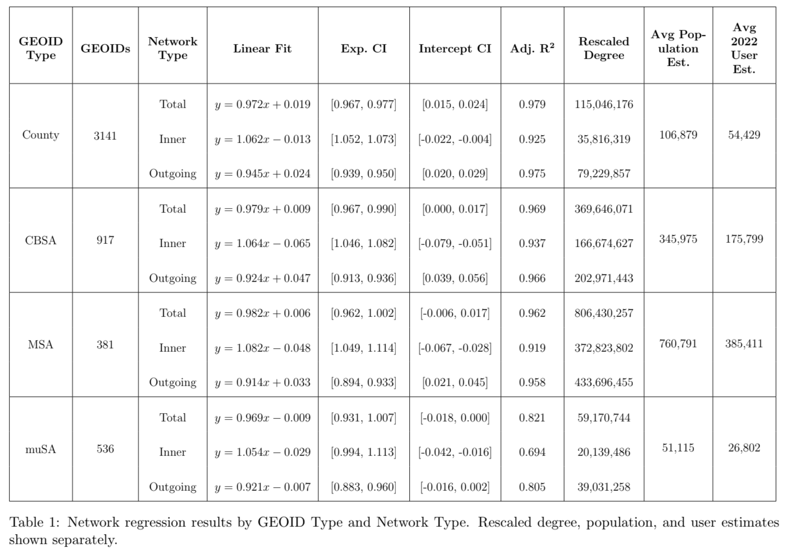

# Scaling of Social Connections & Demographic Analysis

## Ayush Sarkar: 5/15/2025 - 7/11/2025 | CLIMA w/ Dynamical Systems Lab @ NYU

*A study of how Facebook-derived social connectivity scales with population across U.S. counties and Core-Based Statistical Areas (CBSAs), paired with Census-block demographic profiles of coastal NYC communities under flood risk.*

---

## TL;DR

* I take Meta's county-to-county **Social Connectedness Index (SCI)** and combine it with ESRI 2022 Facebook MAU and population estimates to recover absolute Facebook connection counts at the county, CBSA, MSA, and muSA levels.
* I then fit log-log power-law regressions of the form $k = N^{\beta} \cdot \epsilon$ — following the *Schläpfer et al. (2014)* coverage-rescaling methodology — to ask **how social connectivity scales with population**.
* The headline finding holds across every GEOID level: **inner (within-place) connections are superlinear** ($\beta \in [1.054, 1.082]$), **outgoing (cross-place) connections are sublinear** ($\beta \in [0.914, 0.945]$), and **total connections are very close to but slightly below linear** ($\beta \in [0.969, 0.982]$).
* On the demographic side, I produce Census-block-level analyses of **Hamilton Beach / Howard Beach** (Queens) and **Red Hook** (Brooklyn) — two NYC coastal communities sitting in FEMA flood zones — covering age/sex, race/ethnicity, household size, occupancy, tenure, educational attainment, and household income.

For the full methodology, all derivations, and every figure produced, open [`clima.ipynb`](clima.ipynb). The standalone scripts under [`scripts/`](scripts/) mirror the notebook cells one-to-one.

---

## Table of Contents

1. [Background & Motivation](#background--motivation)
2. [Glossary](#glossary)
3. [Data Sources](#data-sources)
4. [Methodology](#methodology)
5. [Results: Scaling](#results-scaling)
6. [Results: Geographic Structure (Choropleths)](#results-geographic-structure-choropleths)
7. [Results: Distributions](#results-distributions)
8. [Results: Demographic Profiles](#results-demographic-profiles)
9. [Interpretation: Why This Matters](#interpretation-why-this-matters)
10. [Caveats](#caveats)
11. [Project Layout](#project-layout)
12. [References](#references)

---

## Background & Motivation

**CiviL Infrastructure research for climate change Mitigation and Adaptation (CLIMA)** is a research effort focused on infrastructure research to help develop equitable and feasible solutions to the increasingly urgent threats posed by climate change, specifically through the mitigation of damages and adaptation to hazards and changes across coastal communities worldwide.

This leg of the CLIMA project is an interdisciplinary research effort that aims to model the effects of flood risk on coastal communities through a detailed investigation of the social networks, as well as other factors, in an attempt to create a model that is more capable of capturing human mobility phenomena — especially amongst homeowners. By using a modified compartmental model, we partition the population into sets and utilize the mean-field hypothesis to treat individuals as identical, thus allowing us to focus on population-level dynamics instead of individual-level cognition. To better appreciate the unique perspectives of individuals and communities that most directly face these threats, this project also includes qualitative information about the network extracted through interviews with homeowners of coastal communities here in NYC. Furthermore, demographic breakdowns of the sampled coastal communities are used to increase our understanding of the context, everyday lives, and equity issues faced by the homeowners within these communities.

**Two strands of literature anchor this notebook:**

- **Urban scaling** (*Bettencourt, West, Schläpfer et al.*) consistently finds that the *intensity of human interaction* within a city scales **superlinearly** with population — bigger cities don't just have more people, they have more interaction *per person*, with the scaling exponent typically falling in the $\beta \approx 1.1\!-\!1.2$ range for European face-to-face / phone-call data. If that pattern holds for online social ties, then aggregate social-network connectivity is itself a population-driven exposure variable, with implications for how shocks (including flood events) propagate through homeowner-decision networks.
- **Mobility & migration models** (*Simini et al., 2012*) treat opportunity ratios as the driver of long-range moves. For coastal homeowners under flood risk, the relevant "opportunity" is the *availability of comparable homes* nearby, weighted by social ties to the destination. The scaling exponents quantified here are the natural empirical input to that kind of model.

The demographic side places the scaling work in concrete neighborhood context: these are real, mostly homeowner, mostly owner-occupied communities sitting inside FEMA flood zones, and any model built on the scaling results above eventually has to reconcile with what those neighborhoods actually look like up close.

---

## Glossary

| Symbol                              | Meaning                                                                                       |
| ----------------------------------- | --------------------------------------------------------------------------------------------- |
| $G$                                 | The full county-level social network graph                                                    |
| $C$                                 | A GEOID-level covering (e.g., the set of counties forming a single CBSA)                       |
| $\tilde{C}$                         | Complement of $C$ (all counties outside $C$)                                                  |
| $n_{\text{GEOID}}$                  | Number of GEOID-level nodes in $G$                                                            |
| $N_i$                               | Population of GEOID $i$ (ESRI 2022 estimate)                                                  |
| $\|S_i\|$                             | 2022 Facebook MAU estimate (30-day) for GEOID $i$                                              |
| $s_i = \|S_i\|/N_i$                   | Coverage estimate for GEOID $i$                                                               |
| $k_{i,\,ic}$                        | Inter-GEOID degree — within-GEOID connections, i.e., $(i,i)$ pairs                            |
| $k_{i,\,o}$                         | Outgoing degree — cross-GEOID connections, i.e., $(i,j)$ with $i \neq j$                       |
| $k_{i,\,t} = k_{i,\,ic} + k_{i,\,o}$ | Total degree of GEOID $i$                                                                     |
| $K_{r,\,i} = k_{i,\,t} / s_i$       | Coverage-rescaled cumulative degree                                                           |
| $\langle K_r \rangle$               | Average rescaled degree across all GEOIDs of a given type                                     |
| $\beta$                             | Scaling exponent — the slope of the log-log regression                                         |
| $\gamma$                            | Intercept of the log-log regression                                                            |
| **ICIC**                            | Inter-Covering Inter-County — within-CBSA, within-county connections                          |
| **ICCC**                            | Inter-Covering Cross-County — within-CBSA, between-county connections                         |
| **OCOC**                            | Outer-Covering Cross-County — connections from a CBSA's counties to counties outside the CBSA |

> **A note on terminology**: throughout this project, the prefix "**Inter-**" denotes *within-GEOID* connections, while "**Outer-**" / "**Outgoing**" denote *cross-GEOID* connections. This is non-standard — conventionally "inter-" means "between" — but it's used consistently across the codebase. If you read `inter_county_connections` in the export CSVs, that is the within-county degree.

---

## Data Sources

| Source                                            | Resolution                  | Role in this analysis                                                                                                  |
| ------------------------------------------------- | --------------------------- | ---------------------------------------------------------------------------------------------------------------------- |
| **Meta Social Connectedness Index (SCI), Oct 2021** | County-to-county (directed) | Friendship-tie measure; the input to every connection-count calculation                                                |
| **ESRI 2022 MAU & Population Estimates**          | 5-digit FIPS county         | Per-county Facebook MAU $\|S_i\|$ (column `MP19049a_B`) and population $N_i$ (column `TOTPOP_CY`); together yield $s_i$ |
| **BLS County-to-CBSA Crosswalk**                  | County $\to$ CBSA / MSA / muSA | Maps each county to its CBSA covering and labels it metropolitan vs. micropolitan                                      |
| **Meta Q4 '22 Earnings (DAU / MAU disclosures)**  | North America aggregate     | External sanity check on $s_i$ — Meta reports ~199M DAU / ~266M MAU vs. ~372M NA population, so $s_{\text{NA}} \approx 0.54\!-\!0.71$ |
| **2020 Decennial Census DHC**                     | Census block                | H3 (occupancy), H4 (tenure), H9 (household size), P3 (race), P5 (Hispanic origin), P12 (sex by age)                    |
| **IPUMS NHGIS `nhgis0004_ds267_20235`** (ACS 5-yr) | Block group                 | Educational attainment and household income for the Hamilton Beach / Red Hook pie charts                               |
| **TIGER/Line shapefiles (2021)**                  | County and CBSA polygons    | Choropleth basemaps                                                                                                    |

After cleaning, the working dataset comprises **3,141 unique FIPS codes**, **917 CBSA codes** (381 MSA + 536 muSA), and **9,865,881 SCI row entries** (= $2 \binom{3{,}141}{2} + 3{,}141$).

**Notable cleaning steps:**

- The post-2020 split of Alaska's Valdez-Cordova Census Area into Chugach (`02063`) and Copper River (`02066`) is re-merged into `02261` so the SCI (which still uses the pre-split-era code) joins cleanly to the ESRI demographics.
- `15005` (Kalawao County, HI) is dropped — its tiny population breaks log-scale plots and produces extreme outliers in coverage.
- The directed SCI dataset is **kept symmetric** throughout. Naive unsymmetrization (deleting one of each $(i,j) / (j,i)$ pair) biases toward whichever FIPS appears first in the source dataframe, so all CBSA-level aggregates are computed using the conserved-total identity $\textbf{OCOC}_{C} = \textbf{Total}_{C} - (\textbf{ICIC}_{C} + \textbf{ICCC}_{C})$ instead.

---

## Methodology

### 1. From SCI to absolute connection counts

Meta publishes the SCI but not the raw connection counts. Both, however, are tied together by:

$$
\text{SCI}_{i,j} = \frac{\text{FB Conn.}_{i,j}}{|S_i|\cdot |S_j|}, \quad i \neq j
$$
$$
\text{SCI}_{i,i} = \frac{\text{FB Conn.}_{i,i}}{|S_i|\cdot (|S_i| - 1)}
$$

The within-county denominator uses $|S_i|(|S_i| - 1)$ rather than $\binom{|S_i|}{2}$ because the SCI is published with both $(i,j)$ and $(j,i)$ entries — each Facebook friendship is double-counted in the directed edge list, which exactly cancels the factor of two from the unordered-pair formula.

Inverting these gives the per-county and per-county-pair connection counts that feed every downstream step.

### 2. Aggregating to CBSA / MSA / muSA

CBSA-level connections are built up from the county-level connections of each CBSA's constituent counties. The three CBSA-level types — **ICIC** (within-CBSA, within-county), **ICCC** (within-CBSA, between-county), and **OCOC** (outside-CBSA) — partition the total degree of a CBSA, so we can recover OCOC via subtraction:

$$
\textbf{OCOC}_{C} = \textbf{Total}_{C} - \big[\textbf{ICIC}_{C} + \textbf{ICCC}_{C}\big]
$$

This avoids having to enumerate $i \in C, j \in \tilde{C}$ pairs explicitly over a ~10M-row directed edge list.

### 3. Coverage rescaling and normalization (per *Schläpfer et al., 2014*)

Because we only see the **Facebook-active subset** of each county's population — and because that coverage rate $s_i = |S_i|/N_i$ varies geographically — fitting a power law directly on $k$ vs. $N$ confounds the scaling we care about with a sampling-rate confound. The *Schläpfer* correction:

1. Divide cumulative degree by coverage: $K_{r,\,i} = k_{i,\,t} / s_i$.
2. Normalize both $K_r$ and $N$ by their averages so the cloud of points is centered at $(1, 1)$ and the regression is scale-invariant.

For MSA-only and muSA-only fits, the averages are taken *within* each subpopulation, not over all CBSAs, so the normalization is internal to the size band being fit.

### 4. Power-law fit

A power law $k = N^{\beta} \epsilon$ becomes linear in log-log space:

$$
\log_{10}\!\Big(\frac{K_r}{\langle K_r \rangle}\Big) = \beta \cdot \log_{10}\!\Big(\frac{N}{\langle N \rangle}\Big) + \gamma + \log_{10}\epsilon
$$

I fit this via OLS in `statsmodels` for each (GEOID type) × (network type) combination, recording $\beta$, $\gamma$, adjusted $R^2$, RMSE, RSE, and 95% confidence intervals on both parameters via the $t$-distribution.

The slope $\beta$ is the quantity of interest:
- **Superlinear** ($\beta > 1$): bigger places generate *disproportionately more* connections per person.
- **Linear** ($\beta = 1$): per-capita rate is constant.
- **Sublinear** ($\beta < 1$): bigger places have *proportionally fewer* connections per person.

---

## Results: Scaling

### The scaling table

The fitted $\beta$ values across all four GEOID levels and all three network types. All CIs are 95%, $t$-distribution with $N - 2$ d.o.f.



> *Table 1: Network regression results by GEOID type and network type. Rescaled degree, population, and user estimates shown separately.*

**Three robust patterns:**

1. **Inner connections are superlinear**: $\beta_{\text{Inner}} \in [1.054, 1.082]$ with CIs strictly above 1 at the County, CBSA, and MSA levels. Same qualitative finding as *Schläpfer et al.* for European urban interaction data, though our point estimates sit at the low end of their range.
2. **Outgoing connections are sublinear**: $\beta_{\text{Outgoing}} \in [0.914, 0.945]$ with CIs strictly below 1 at the County, CBSA, and MSA levels. Larger places generate proportionally *fewer* outgoing per-capita ties — denser local networks appear to crowd out long-range ties.
3. **Total connections sit just below linearity**: $\beta_{\text{Total}} \in [0.969, 0.982]$. The two opposing effects above almost — but not quite — cancel.

**Stability across GEOID resolution.** The slopes barely move as we go County → CBSA → MSA, which is a sanity check that the scaling is a real property of the social network and not an artifact of how the geographic partition was drawn.

**The muSA caveat.** Micropolitan-only fits are noisier ($R^2 \approx 0.69\!-\!0.82$ vs. $\approx 0.92\!-\!0.96$ for MSA) and the muSA Total CI ($[0.931, 1.007]$) actually *includes* 1.0 — i.e., for total connectivity in micropolitan areas we cannot statistically reject pure linearity. This is consistent with micropolitan areas spanning a narrower population range, giving the regression less leverage.

### County-level regressions

The county-level fit is the most data-rich (3,141 points) and the cleanest visually. The superlinear Inner slope, sublinear Outgoing slope, and almost-linear Total slope are all visible by eye.


> *Figure 1: Log-log OLS fits of normalized rescaled cumulative degree vs. normalized population at the County level. Left: Inter-County (within-county). Center: Outgoing (cross-county). Right: Total. Inset boxes report $\beta$, $\gamma$, $R^2$, RMSE, RSE, sample size, and the average ESRI user / population estimates.*

### CBSA-level regressions

Aggregating up to CBSAs collapses the 3,141 points into 917 and improves visual separability — but the slopes barely move, which is the point.


> *Figure 2: Log-log fits at the CBSA level (combined Metropolitan + Micropolitan). The pattern from Figure 1 is preserved: Inner superlinear, Outgoing sublinear, Total just-below-linear.*

### MSA-only regressions

Restricting to MSAs (381 metropolitan-only CBSAs) further reduces sample size but tightens the signal-to-noise for the metro-only band of populations.


> *Figure 3: MSA-only fits. The Inner slope creeps up to $\beta = 1.082$ and the Outgoing slope down to $\beta = 0.914$ — the most extreme deviations from linearity in the entire study, which is consistent with metro-only areas being the regime where the urban-scaling effect would be cleanest.*

---

## Results: Geographic Structure (Choropleths)

Before collapsing everything to a single regression slope, it's worth confirming that the connection counts have the *geographic* structure we'd expect.

### Raw connection counts

The maps light up exactly where they should — the BosWash corridor, the California megaregion, the Texas Triangle, the Front Range, and Florida — and dim out across the High Plains and rural Mountain West.


> *Figure 4: County-level choropleths of Inter-County (within), Outgoing (cross-county), and Total connections. Color is on a log scale; ticks are formatted in raw connection counts for readability.*

### User, population, and coverage

The user and population maps show the same metro / coastal weighting one would expect. **The coverage map is the more revealing of the three** — coverage ranges from ~0.34 to ~0.63 across counties, with the highest values in dense, younger, more-online counties (urban Northeast, Pacific coast, parts of the Mountain West) and the lowest values in much of the rural South and Plains. This is exactly the kind of *geographically heterogeneous undercount* that the *Schläpfer* rescaling step is designed to absorb.


> *Figure 5: County-level ESRI user-count estimates $|S_i|$ (left, log scale), population estimates $N_i$ (center, log scale), and coverage estimates $s_i = |S_i|/N_i$ (right, linear, range ~0.34-0.63).*

### Per-user connections (after rescaling)

After dividing connection counts by Facebook MAU, the per-user choropleth is visibly *flatter* than the raw-count choropleth above. This is the qualitative confirmation that the coverage rescaling has done its job — once we strip out the population-driven baseline, per-user connectivity is no longer dominated by where the people are.


> *Figure 6: County-level connections **per Facebook user**. Note the much narrower color range relative to Figure 4 — the regional heterogeneity that remains is the true signal, not the population baseline.*

---

## Results: Distributions

For each variable, we fit a Kernel Density Estimate (KDE, Gaussian kernel) as the non-parametric reference PDF and compare four parametric candidates — **Normal**, **Log-Normal**, **Skew-Normal**, and a **Generalized Pareto** fit to the top 75% tail — by RMSE against the KDE at the bin centers.


> *Figure 7: $\log_{10}$ SCI distributions per county for Inner (left), Outgoing (center), and Total (right) connections, with KDE (black) and parametric overlays. The log-transformed distributions are close to Normal in shape — i.e., the raw counts are roughly **log-normal**, which is the canonical distribution from multiplicative growth processes. This is precisely what justifies the log-log power-law fit.*

The fitted Log-Normal PDF has the lowest RMSE vs. KDE for the bulk of variables. The Generalized Pareto fit to the top tail captures the heavy upper end (the few outsize metros that dominate the absolute connection counts) without forcing the bulk distribution into a heavy-tailed family. The full set of distribution plots — broken out by County, CBSA, MSA, and muSA, for both raw counts and per-capita / per-user ratios — lives in [`plots/histograms/`](plots/histograms/).

---

## Results: Demographic Profiles

The demographic section zooms from the national scaling picture down to a handful of NYC census blocks — specifically the **Hamilton Beach + Howard Beach** blocks in Queens (FIPS prefix `360810884006`), and **Red Hook** in Brooklyn as a comparison. Both communities sit in FEMA-designated coastal flood zones; both are points of contact for CLIMA's homeowner interviews.

### Hamilton & Howard Beach (Queens)

#### Age/sex composition


> *Figure 8: Age/sex population pyramid for the selected Hamilton + Howard Beach census blocks (bars), with NYC census-block averages overlaid as dots. The pyramid skews noticeably **older** than the NYC baseline — the bulk of residents are in the 30-64 range, with under-representation in the 18-29 cohort relative to citywide averages.*

#### Race / ethnicity


> *Figure 9: Race / ethnicity distribution for Hamilton + Howard Beach (bars) vs. NYC average (dots). The selected blocks are markedly more **White (non-Hispanic)** (~47% vs. ~53% NYC) and more **Hispanic / Latino** (~36% vs. ~20% NYC), and markedly less **Black (non-Hispanic)** (~6% vs. ~14% NYC).*

#### Household size


> *Figure 10: Household size distribution. Hamilton + Howard Beach is shifted toward 3- and 4-person households relative to the citywide mix, and away from 1-person households (~23% vs. ~30% NYC) — consistent with a family-oriented, owner-occupied profile.*

#### Housing occupancy and tenure


> *Figure 11: Occupied vs. vacant housing. The selected blocks track NYC averages closely (~90% occupied).*


> *Figure 12: Owner- vs. renter-occupied housing. **Hamilton + Howard Beach is ~63% owner-occupied vs. ~51% citywide** — this single number is the most consequential demographic feature for CLIMA's homeowner-focused mobility model.*

#### Education & income


> *Figure 13: Hamilton Beach educational attainment (left) and household income (right). ~30% of adults have no HS diploma, ~26% have only a HS diploma, and only ~24% hold a bachelor's degree or higher. ~48% of households earn between \$60k-\$85k, with a long thin upper tail.*

### Red Hook (Brooklyn) — for comparison

The Red Hook pie chart below uses the same education/income bins as Hamilton Beach so the two distributions are directly comparable. The differences are stark.


> *Figure 14: Red Hook educational attainment (left) and household income (right). Compared to Hamilton Beach: substantially **more bachelor's-and-above** (~32% vs. ~24% in HB), a much **more bimodal income distribution** (large mass at <\$10k *and* a fat upper tail with ~25% of households over \$100k), and a noticeably more even spread across the middle income brackets. The two communities sit in similar FEMA flood-zone designations but represent meaningfully different **social** exposures to a flood event.*

### Hamilton Beach vs. Red Hook, at a glance

| Variable                       | Hamilton + Howard Beach | Red Hook (block groups) |
| ------------------------------ | ------------------------ | ----------------------- |
| Bachelor's degree or higher    | ~24%                     | ~32%                    |
| No HS diploma                  | ~30%                     | ~18%                    |
| Median income bracket          | \$60k-\$85k (~48%)       | \$10k-\$25k (~17%)      |
| Households earning \$100k+     | ~12%                     | ~25%                    |
| Housing tenure (owner-occupied, NYC comparison) | High (~63%, vs. ~51% NYC) | Lower (predominantly renter) |
| Dominant household size mode   | 2- and 3-person          | 1- and 2-person         |

The takeaway is that **"coastal homeowner under flood risk"** is not a uniform agent class — it spans communities with very different baselines for income, education, and tenure, and any compartmental or radiation-style mobility model built on top of the scaling exponents in this notebook eventually has to be calibrated to those differences.

---

## Interpretation: Why This Matters

Putting the scaling and demographic pieces side by side:

- The national scaling result implies that **per-capita social connectivity is not constant across population scale**. Larger cities and CBSAs have superlinear within-region connectivity, sublinear cross-region connectivity, and near-linear total connectivity. In modeling terms, this means the *effective transmission rate* of any process spreading through the social graph — flood-risk information, neighbor-mover signals, policy uptake — depends on the population scale of the place you're standing in, not just on per-capita averages.
- In the CLIMA context, that matters because **information about flood risk, neighbor relocation decisions, and policy interventions propagates through these ties**. A coastal block in a large CBSA (e.g., Hamilton Beach inside New York-Newark-Jersey City) is embedded in a denser local network than the same-sized population would be in a micropolitan area, so the *effective speed* of decision-cascades is regionally heterogeneous in a quantifiable way.
- The demographic snapshots show what those nodes actually look like up close — predominantly owner-occupied, older-than-citywide, with a HS-or-less education plurality in Hamilton Beach, vs. a more bimodal income, more educated, and more renter-dominant Red Hook. Any model that treats "homeowners" as a uniform agent class would erase exactly the heterogeneity that the demographic plots make visible.
- The combination of the two layers — *macroscopic* scaling exponents plus *block-level* demographic context — is the empirical scaffolding for the next phase of the CLIMA modeling work, which marries these inputs to FEMA's National Risk Index in a *Simini-style* mobility model with "available comparable housing" as the opportunity surface.

---

## Caveats

* **County-level Facebook MAU is not publicly reported by Meta.** ESRI is our best stand-in, but comparing our derived average $s_i$ against Meta's published Q4 '22 MAU figure suggests the ESRI-derived coverage runs ~17% below the true MAU coverage. A uniform underestimate would shift $\gamma$ uniformly, but because ESRI's MAU model is itself geographically heterogeneous, there is also a second-order effect on $\beta$ that's harder to bound. The most plausible direction is that the true $\beta_{\text{Outgoing}}$ and $\beta_{\text{Total}}$ are *slightly more sublinear* than reported here.
* **SCI itself is noised.** Gaussian noise in $\pm[0,1]$ is added by Meta to each connection count for privacy. This dominates the signal for counties just above the 50,000-user reporting threshold and contributes to the wider muSA confidence intervals.
* **ESRI MAU is a model output**, not a direct count — two layers of estimation (Meta's true MAU → ESRI's modeled MAU → our $|S_i|$) sit between the underlying truth and the regressor.
* **The demographic figures are descriptive.** Two communities ≠ a generalizable claim about coastal NYC. Hamilton Beach + Howard Beach and Red Hook are case studies that ground the modeling work in concrete examples, not a representative sample.
* **2021 SCI paired with 2022 ESRI.** The temporal mismatch is small and Meta has shown the SCI to be stable across longer time horizons, but it is a mismatch.

---

## Project Layout

```
clima/
├── clima.ipynb                  # Annotated end-to-end analysis notebook (full details live here)
├── README.md                    # This file
├── clima_poster.pdf             # Conference poster summarizing the work
├── clima_figures.pdf            # All figures, full resolution
├── scripts/
│   ├── data/data_cleaning.py            # SCI + ESRI + crosswalk → export CSVs
│   └── visualization/
│       ├── choropleths/choropleth.py
│       ├── histograms/histograms.py
│       ├── regression and ests/regression.py
│       └── demographics/{demographics,py_chart}.py
├── source/                      # Raw input data (SCI, users, crosswalk, Census, shapefiles)
├── export/                      # Cleaned CSVs consumed by visualization scripts
├── plots/                       # PNG outputs (choropleths, histograms, regressions, demographics)
└── image/                       # README and notebook images (coverage screenshots, etc.)
```

The notebook is the single source of truth — every plot in this README was rendered by code that also appears in [`clima.ipynb`](clima.ipynb). The standalone Python scripts under `scripts/` are extracted directly from the notebook cells if you'd rather run them outside Jupyter.

---

## References

### Meta SCI Resources

- [SCI Homepage](https://data.humdata.org/dataset/social-connectedness-index)
- [SCI Methodology](https://dataforgood.facebook.com/dfg/docs/methodology-social-connectedness-index)
- [SCI Docs](https://data.humdata.org/dataset/e9988552-74e4-4ff4-943f-c782ac8bca87/resource/a0c37eb4-b45c-436d-b2b2-c0c9b1974318/download/documentation-fb-social-connectedness-index-october-2021.pdf)
- [County-to-County SCI Dataset](https://data.humdata.org/dataset/e9988552-74e4-4ff4-943f-c782ac8bca87/resource/c59fd5ac-0458-4e83-b6be-5334f0ea9a69/download/us-counties-us-counties-fb-social-connectedness-index-october-2021.zip)

### Meta Official Regional Coverage Estimates

- [Meta Q4 '22 Earnings Presentation](https://s21.q4cdn.com/399680738/files/doc_financials/2023/q4/Earnings-Presentation-Q4-2023.pdf)

### ESRI Facebook User Estimates

- [ESRI Data](https://nyuds.maps.arcgis.com/home/item.html?id=14a2fb32e22b4fe5ab9d884c9e994075)
- [ESRI Documentation](https://demographics5.arcgis.com/arcgis/rest/services/USA_MPI_1_2022/MapServer/7)

### Crosswalk

- [County-MSA-CSA Crosswalk](https://www.bls.gov/cew/classifications/areas/county-msa-csa-crosswalk.html)

### Census / Demographic Data

- [IPUMS NHGIS](https://www.nhgis.org/) — 2020 DHC and ACS extracts
- [TIGER/Line Shapefiles (2021)](https://www.census.gov/geographies/mapping-files/time-series/geo/tiger-line-file.html)

---

### Bibliography

1. Bailey, Michael, Rachel Cao, Theresa Kuchler, Johannes Stroebel, and Arlene Wong. **"Social Connectedness: Measurement, Determinants, and Effects."** *Journal of Economic Perspectives* 32, no. 3 (August 2018): 259-280. DOI: [10.1257/jep.32.3.259](https://doi.org/10.1257/jep.32.3.259)
2. Schläpfer, M., Bettencourt, L. M. A., Grauwin, S., Raschke, M., Claxton, R., Smoreda, Z., West, G. B., & Ratti, C. (2014). **The scaling of human interactions with city size.** *Journal of the Royal Society Interface*, **11**(98), 20130789. DOI: [10.1098/rsif.2013.0789](https://doi.org/10.1098/rsif.2013.0789)
3. Simini, F., González, M., Maritan, A., et al. **A universal model for mobility and migration patterns.** *Nature* **484**, 96-100 (2012). DOI: [10.1038/nature10856](https://doi.org/10.1038/nature10856)

---

al fin :]
